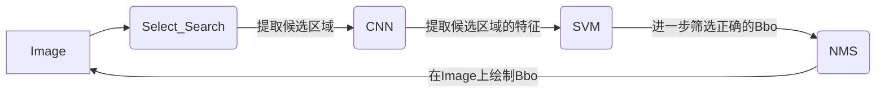

# 从零开始目标识别:R-CNN

> R-CNN算法的整个流程主要分为4步(原始论文中最后还有一步Bbox回归，这里暂未去实现)：
>
> - **step1：生成候选区域和候选区域数据集**
>
>   使用Selective Search算法提取图片中的候选区域（Region Proposal）。将其作为train_data，并且将每个得到的region与原图片标定的bbox（Bounding Box）**计算IOU**。并依据IOU为每个region标定分类label，作为train_label。与前面得到的train_data一起生成**候选区域数据集regions**
>
> - **step2：CNN特征提取器**
>
>   直接**Fine Turn VGG16,** 作为CNN特征提取网络
>
> - **step3：SVM区域分类器**
>
>   用CNN特征提取器提取的特征训练SVM，使用SVM判断候选区域中是否包含目标物
>
> - **step4：测试**
>
>   先用Selected Search算法提取测试图片的Region Proposal，将前2000个region送入训练好的CNN模型提取特征，并使用SVM分类器预测这些region的分类。从而选出包含目标物的region
>
> 下面将会依次实现每个步骤
>
> [参考博客](https://towardsdatascience.com/step-by-step-r-cnn-implementation-from-scratch-in-python-e97101ccde55)
>
> [论文（arxiv）](https://arxiv.org/abs/1311.2524)
>
> [github源码](https://github.com/phww/Study-Model-Myself/tree/main/R-CNN)
>
> [MD文档](https://github.com/phww/Study-Model-Myself/blob/main/R-CNN/%E4%BB%8E%E9%9B%B6%E5%BC%80%E5%A7%8B%E7%9B%AE%E6%A0%87%E8%AF%86%E5%88%ABR-CNN.md)

**quick review：**


## 一.数据集

使用一个关于飞机检测的数据集:Airplane，来自[github](https://github.com/1297rohit/RCNN)

Airplane目录下有两个文件夹：


- Image:内为各种飞机场图片大小5k-100k，共700多张图片。后缀.jpg

  

- Airplanes_Annotations:内为用csv格式存储的事先标注的bbox信息, 除了后缀为.csv外文件名称和Image中的文件名称一一对应。其格式如下：


​			第一行为对应图片有几个bbox，后面每行代表一个bbox。其中4个数据(x1,y1,x2,y2)代表bbox的左上角坐标(x1,y1)，和右下角坐标(x2,y2)

---


## 二.region proposal 和 regions数据集

本章节代码：R-CNN/selective search/*       R-CNN/dataset.py

### 1.selective search算法

#### 前言

事实上最简单的提取候选区域的方法是**滑动窗口算法(Sliding Window)**。顾名思义，滑动窗口会使用固定大小的窗口在原始图片上滑动，将原始图片分割为一块块窗口大小的图片。但是图片上同一物体的大小因为摄像角度的问题，尺寸变化很大。因此使用滑动窗口时，为了**适应不同尺度的目标**。要根据数据集的情况选择多个尺寸的窗口分割原始图片。本质上，这是一种**穷举**的过程。因此滑动窗口提取候选区域的效率十分低下，直接淘汰。

#### selective search原理（简谈）

与滑动窗口的穷举不同，selective search算法使用**启发式**的方法提取候选区域

- 首先，输入一张图片后，使用一些图像分割的算法将图片**分割为多个小图块**
- 合并一些小图块
  - 根据每个小图块两两之间的**相似度**进行合并
  - 相识度的度量：**颜色空间，纹理，尺度，重叠度**...理论上综合考虑以上的度量标准，有利于提高提取的候选区域的质量（高recall）

#### 算法流程：


- 提取图块间的相似度
  - 输入图片，并使用一些图像分割算法得到初始的小图块合集$R={r_1,r_2...r_n}$
  - 对每个小图块$r_i$搜索与它**相邻**的其他图块$r_j$。对每对图块$(r_i,r_j)$计算相似度$s(r_i,r_j)$，并加入到相似度合集S中
- 合并图块
  - while 相似度合集S非空，下面开始循环
  - 选择S中相似度最大的一对色块$(r_i,r_j)$，合并他们为$r_t=r_iUr_j$。之后从S中删除与$r_i,r_j$有关的相似度
  - 再次计算合并后的图块$r_t$与其相邻的其他色块的相似度$s(r_t,r_k)$，并加入到S中去
  - 将$r_t$作为新的图块加入到图块合集$R$中

- 整个算法流程中，S集合中的元素会一直减少到0，代表全部R中的初始色块最终合并为了原始图片。R集合中的色块会增加，增加的色块代表着根据启发式信息分层合成的更加整体的色块


### 2.用opencv实现selective search算法

这个算法还是挺难的...时间有限，这里使用opencv提供的API实现该算法。同时复习下C++，这里使用C++的opencv实现。在下面使用pytorch中训练模型时，也会使用python版本的selective search算法

#### 文件读取的辅助函数

- 头文件

  ```c++
  #include <iostream>
  #include <ctime>
  #include <opencv2/highgui.hpp>
  #include <opencv2/core.hpp>
  #include <opencv2/imgproc.hpp>
  // selective search 算法的头文件
  #include <opencv2/ximgproc/segmentation.hpp> 
  // 使用该头文件下的split()函数，划分字符串
  #include <boost/algorithm/string.hpp>
  // 遍历文件夹和读取csv文件数据的辅助函数
  #include "getFiles.h"
  #include "readCsv.h"
  using namespace std;
  ```
  
- 两个helper函数。具体看代码注释，不展开

  **getFiles.cpp**    [详解博客](http://www.phww98.com/index.php/archives/13/)

  ```c++
  #include <iostream>
  #include <string>
  #include <vector>
  #include <dirent.h>
  #include <cstring>
  
  //struct dirent
  //{
  //  __ino_t d_ino;   /*inode number 索引节点号*/
  //  __off_t d_off;   /*offset to this dirent 在目录文件中的偏移*/
  //  unsigned short int d_reclen;   /*length of this d_name 文件名长*/
  //  unsigned char d_type;   /*the type of d_name 文件类型*/
  //  char d_name[256];    /*file name(null-terminated) 文件名 */
  //};
  
  using namespace std;
  void getFiles(const string &root, vector<string> &files) {
    DIR *pDir; //指向根目录结构体的指针
    struct dirent *ptr; //dirent结构体指针，具体结构看开头的注释
    // 使用dirent.h下的opendir()打开根目录，并返回指针
    if (!(pDir = opendir(root.c_str()))) {
  	return;
    }
    // 使用dirent.h下的readdir逐个读取root下的文件
    while ((ptr = readdir(pDir)) != nullptr) {
  	// 这里我理解他的指针应该是自动会指向到下一个文件，所以不用写指针的移动
  	string sub_file = root + "/" + ptr->d_name; // 当前指针指向的文件名
  	if (ptr->d_type != 8 && ptr->d_type != 4) { // 递归出口，当不是普通文件（8）和文件夹（4）时退出递归
  	  return;
  	}
  	// 普通文件直接加入到files
  	if (ptr->d_type == 8) {
  	  // 相当于将命令下使用ls展示出来的文件中除了. 和 ..全部保存在files中
  	  // 当然下面可以写各种字符串的筛选逻辑，比如只要后缀有.jpg图片
  	  if (strcmp(ptr->d_name, ".") != 0 && strcmp(ptr->d_name, "..") != 0) {
  //		if (strstr(ptr->d_name, ".jpg")) {
  		files.push_back(sub_file);
  //		}
  	  } // 当前文件为文件夹(4)类型，那就以当前文件为root进行递归吧！
  	} else if (ptr->d_type == 4) {
  	  // 同样下面也可以写文件夹名字的筛选逻辑，比如root/下有train，test文件夹，只遍历train文件夹内的文件
  	  if (strcmp(ptr->d_name, ".") != 0 && strcmp(ptr->d_name, "..") != 0) {
  		getFiles(sub_file, files);
  	  }
  	}
    }
    // 关闭根目录
    closedir(pDir);
  ```
  
  **readCsv.cpp**

  ```c++
  #include <boost/algorithm/string.hpp> //使用里面的spilt分割字符串
  #include <fstream>
  #include <iostream>
  #include <string>
  #include <opencv2/core.hpp>
  #include <opencv2/imgproc.hpp>
  #include <opencv2/highgui.hpp>
  
  using namespace std;
  
  /*!
   * @brief 读取csv格式的标注，并保存到cv::Rect对象中去
   * @param csv_path csv文件路径
   * @param rects 保存cv::Rect的vector
   */
  void readCsv(const string &csv_path, vector<cv::Rect> &rects) {
  
    ifstream fin;
    fin.open(csv_path); // 打开csv文件到文件流fin
    string line;
    getline(fin, line); // 第一行是该csv文件内有几个标注，不需要使用这个信息
    // 每次读取文件流中的一行，保存在line中
    while (getline(fin, line)) {
  	vector<string> line_spilt;
  	cv::Rect rect;
  	// 用boost库内的spilt分割字符串。即将"1 2 3 4"分割为"1","2","3","4"
  	boost::split(line_spilt, line, boost::is_any_of(" "));
  	// Airplane数据集内的标注是以左上角坐标(x1，y1)和右下角坐标(x2,y2)的形式表示矩形框的
  	// 而cv::Rect 是以左上角坐标(x,y)和矩形的width和height表示矩形框
  	int x1 = stoi(line_spilt[0]), y1 = stoi(line_spilt[1]);
  	int x2 = stoi(line_spilt[2]), y2 = stoi(line_spilt[3]);
  	rect.x = x1, rect.y = y1;
  	rect.width = abs(x1 - x2), rect.height = abs(y1 - y2);
  	rects.push_back(rect);
    }
  }
  ```

#### selective search算法

- 目的：使用selective search算法提取Airplane数据集中**每个图片的候选区域**，并与数据集的标注比较。**为每个候选区域确定一个标签**：其中1-airplane，0-background。为了控制**候选区域数据集**的大小：

  - 第一：每个Airplane数据集中图片产生的成千上万个候选区域中。只最多选择**30个正例子和30个负例**样本

  - 第二：每个候选区域的标签被包含在候选区域的文件名之中，文件名中的**-1-和-0-代表标签**。如36-1-airplane_162.jpg，表示原始图片airplane_162.jpg在第36号候选区域中的标签为1，代表该区域(图片)中有目标物（飞机）

  - 最终整个Airplane数据集生成了大小为40224带**标签的候选区域数据集regions**。下面是生成图片的例子：

      
  
- opencv中使用Selective Search算法的API [opencv官方文档](https://docs.opencv.org/4.5.2/d6/d6d/classcv_1_1ximgproc_1_1segmentation_1_1SelectiveSearchSegmentation.html)

  - quick start:
    1. 用createSelectiveSearchSegmentation()生成SS对象
    2. 使用SS的setBaseImage()，设置待处理图片。只能一张张设置和处理！
    3. 使用SS的switchToSelectiveSearchQuality/Fast()，选择处理strategy
    4. 使用SS的process()处理设置的图像并返回候选区域。返回类型为cv::Rect
  - 其中的逻辑就是**根据需要处理的图像和处理strategy**，得到候选区域。上面的方法是最简单的，因为处理strategy会根据switch方法自动生成
  - 也可以使用addImage()和addStrategy()来手工设置算法的处理逻辑。我以为使用addImage()方法可以添加一个批次的图片之后在进行process()处理，得到一批候选区域。但是好像还是只能处理一张？

- 代码

```c++
/*!
 * 计算两个rect对象的iou
 * @param rects： selected search算法得到的rect
 * @param gt_rect：标注的ground truth
 * @return iou：两个rect的交并比
 */
double calcIOU(const cv::Rect &rects, const cv::Rect &gt_rect) {
  // 使用cv::Rect表示bbox的优势就是：可以方便的使用a|b表示并集，a&b表示交集
  cv::Rect I = rects & gt_rect;
  cv::Rect U = rects | gt_rect;
  double iou = I.area() * 1.0 / U.area();
  return iou;
}

int main() {
  clock_t start_time = clock();
  // 设置自动优化和多线程，可以加速程序
  cv::setUseOptimized(true);
  cv::setNumThreads(8);
  // select_search对象
  cv::Ptr<cv::ximgproc::segmentation::SelectiveSearchSegmentation>
	  ss = cv::ximgproc::segmentation::createSelectiveSearchSegmentation();

  // 读取image目录下的所有图片
  vector<string> gt_paths;
  vector<string> img_paths;
  getFiles("/home/ph/Dataset/Airplane/Airplanes_Annotations", gt_paths);
  getFiles("/home/ph/Dataset/Airplane/Images", img_paths);
  // sort竟然支持string数组的排序！！！
  // 对img_paths和gt_paths排序，保证两者同一下标表示的图片和标注能够匹配
  sort(gt_paths.begin(), gt_paths.end());
  sort(img_paths.begin(), img_paths.end());
  cout << "待处理图片总数量：" << img_paths.size() << endl;

  // 下面用selected search逐个处理图片
  for (int i = 0; i < img_paths.size(); i++) {
	string img_path = img_paths[i];
	string gt_path = gt_paths[i];
	// cv::Rect 内包含4个元素，矩形的左上角坐标(x，y)以及矩形的宽w和长h
	vector<cv::Rect> rects;// 保存region的vector,其中selected search算法返回的是opencv中的Rect类型的数据
	// 读取图片和ground_truth
	cv::Mat img = cv::imread(img_path, 1);
	vector<cv::Rect> gt_rects;
	readCsv(gt_path, gt_rects);
	// 使用switch...自动选择处理strategy时，需要先设置一个base_img。然后才能给出对应的strategy
	ss->setBaseImage(img); //设置为base_img
	// 设置处理精度
	ss->switchToSelectiveSearchQuality();
	// 处理图像,结果保存在rects中
	ss->process(rects);
	cout << "处理图片：" << i + 1 << " " << "候选区域数量：" << rects.size() << endl;

	// 处理这些regions
	int t_cnt = 0, f_cnt = 0; //统计正列和负例的数量，一般一副图片生成的regions中只要30个正列、负例就行
	vector<string> split_path;
	//获取图片的名称，方便下面给新图片命名使用
	boost::split(split_path, img_path, boost::is_any_of("/")); //c++的STL连个split都没有！！？
	string img_name = split_path.back();
	//当前处理图片，由selected search算法得到的每个region和标注的gt_rect都要计算iou
	for (int j = 0; j < rects.size() && j < 2000; j++) {
	  cv::Rect rect = rects[j];
	  int cnt = 0; //下面判断负例的依据
	  for (const auto &gt_rect : gt_rects) {
		// 依次计算iou
		double iou = calcIOU(rect, gt_rect);
		// 根据iou为每个region打上标签
		// 如果这个region与标注中的任意一个gt_rect的iou>0.7就判断其为正例
		// 如果这个region与标注中的所有gt_rect的iou都小于0.3,就判断其为负例。因此要用cnt统计一下该信息
		if (iou > 0.7 && t_cnt <= 30) {
		  cv::Mat region(img, rect); // Mat可以使用原图像加rect的方式切割原图片的形式初始化
		  //resize到统一大小，方便之后输入到CNN中
		  //这里不使用默认的双线性差值的方法，使用基于像素面积的采样方法
		  cv::resize(region, region, cv::Size(224, 224), cv::INTER_AREA);
		  //使用字符流来实现格式化字符串，为新图像命名，命名规则：j+正例(1)负例(0)+图像原名
		  ostringstream file_name;
		  file_name << "./region/" << j << "-1-" << img_name;
		  cv::imwrite(file_name.str(), region);
		  t_cnt++;
		} else if (iou < 0.3) {
		  cnt++;
		}
	  }
	  // 当cnt等于当前处理图片标注的数量时，代表该region是个背景（负例）
	  if (cnt == gt_rects.size() && f_cnt <= 30) {
		cv::Mat region(img, rect);
		cv::resize(region, region, cv::Size(224, 224), cv::INTER_AREA);
		ostringstream file_name;
		file_name << "./region/" << j << "-0-" << img_name;
		cv::imwrite(file_name.str(), region);
		f_cnt++;
	  }
	}
  }
  clock_t end_time = clock();
  cout<<"Done!"<<" "<<"total_time"<<(end_time - start_time)/CLOCKS_PER_SEC<<"s"<<endl;//2238s
  return 0;
}
```

- 注意事项

  - 生成候选区域的时间与图像的**分辨率**高度相关，刚开始Airplane数据集中不知道作者是否是故意放了一张4K的图片Lhasa.jpg。处理到此图片时30min都没有出结果，因此该图片被我人为剔除了
  - 处理了700多张图片5-100k的图片，每张图片在使用switchToSelectiveSearchQuality()会产生700-20000多张候选区域。一共用时2238s

- 最终结果

  下面左边的图片经过Selective Search算法处理后，一共产生了876个Bbox。很明显将全部的Bbox都画出来是不合理的。接下来训练的CNN模型和SVM分类器，就是为了判断哪些Bbox中包含了目标，然后保留这些Bbox。以减少Selective Search算法产生的候选区域

  


### 3.制作候选区域数据集regions

为了在之后的环节训练CNN特征提取网络和SVM分类器，需要用Pytorch中的Dataset封装Selective Search算法提取的候选区域数据集regions。以下代码包含于dataset.py文件内   [博客：使用Pytorch制作自己的Dataset]()

```python
class Airplane(Dataset):
    def __init__(self, root, transforms):
        super(Airplane, self).__init__()
        self.root = root
        self.img_paths = os.listdir(root)
        self.transforms = transforms

    def __len__(self):
        return len(self.img_paths)

    def __getitem__(self, idx):
        img_path = os.path.join(self.root, self.img_paths[idx])
        img_name = img_path.split("/")[-1]  # 暂时没用上
        label = 0
        # 按照img路径名的是否含有特定字符，设定标签
        if "-0-" in img_path:
            label = 0
        elif "-1-" in img_path:
            label = 1
        img = Image.open(img_path).convert("RGB")
        img = np.array(img)
        if self.transforms:
            img = self.transforms(img)
        return img, label
```

---


## 三.Fine Turn VGG16并训练SVM分类器

本章节代码：R-CNN/model.py      R-CNN/train.py


### 1.目的

成功用Selective Search算法提取的候选区域数量太多且大多数候选区域不包含识别目标。但是可以训练一个分类器将这些候选区域**区分为有目标的区域和无目标的区域**。最后只保留有目标的区域，因此可以快速减少候选区域的数量。

图像分类任务可以使用**CNN或者结合SVM**（论文中作者提倡的方式）来解决。本文中使用VGG16_bn作为CNN特征提取网络。VGG16网络的结构如下：


这里冻结**除了最后的FC（Dense）层**以外的VGG16模型的全部参数，重新更改FC层的输出神经元的个数（从1000改为1）并重新训练。定制的的FC层具体为:Linear(25088, 4096)->Linear(4096,1000)->Linear(1000,1)。这里注意，在训练SVM分类器时，使用的输入为Linear(25088, 4096)层输出的**长度为4096的特征向量**。


### 2.直接使用CNN分类 & SVM分类

实际上上面Fine Turn VGG16时，最终的输出神经元的个数为1，就是为了与pytorch中的BCEWithLogitsLoss()配合使用。达到训练二分类CNN模型的目的。但是论文作者在原文中提出使用SVM分类器可以得到更好的效果，而训练SVM分类器需要使用Linear(25088, 4096)层输出的长度为4096的特征向量。（**这里有个问题：我是直接训练的整个CNN模型（输出为1），之后使用中间层的输出来训练SVM。这和直接用最终输出就是4096个神经元的FC层的输出，来训练SVM还会有很大的区别吗？）**


### 3.Fine Turn VGG16

pytorch中Fine Turn一个模型需要**先冻结模型的所有参数**：设置所有params的requires_grad = False。再建立一个新的layers**代替**想要重新训练的layer。具体代码如下，代码包含在model.py内

```python
class RCNN(nn.Module):
    """
    Fine Turn VGG_16作为特征提取网络
    """

    def __init__(self):
        super(RCNN, self).__init__()
        self.vgg_ft = vgg16_bn(pretrained=True)
        # 冻结vgg16的全部参数
        for params in self.vgg_ft.parameters():
            params.requires_grad = False
        # 替换vgg16的classifier层，使最终输出的特征向量长度为1
        self.new_layers = nn.Sequential(nn.Linear(25088, 4096),  # train.py中会在这里设置hook，以获取该层的输出用于训练svm
                                        nn.ReLU(),
                                        nn.Dropout(p=0.5),
                                        nn.Linear(4096, 1000),
                                        nn.ReLU(),
                                        nn.Dropout(p=0.5),
                                        nn.Linear(1000, 1))
        self.vgg_ft.classifier = self.new_layers

    def forward(self, inp):
        return self.vgg_ft(inp)
```


### 4.获取中间层的输出

训练SVM分类器时，将会使用Linear(25088, 4096)层的输出的特征向量。在Pytorch中为了获取中间层的输出，需要一个额外的操作——设置**register_forward_hook**。目前我也不太了解这个的原理，只是使用。其机制大致类似于用register_forward_hook标记模型中的某个层次，并生成一个hook对象。之后一旦往模型中输入数据，数据流前向传播经过挂有hook的层次时，hook对像中的feature属性会保存该层次的输出。我们可以使用任何tensor操作来处理这个hook.feature。[Pytorch中的hook的使用详解](https://zhuanlan.zhihu.com/p/267130090)     [官网文档](https://pytorch.org/docs/stable/generated/torch.nn.Module.html?highlight=register#torch.nn.Module.register_forward_hook)

使用register_forward_hook机制制作的一个小工具，代码包含在model.py内

```python
class LayerActivations:
    """
    参考别人的一个小方法：获取中间层的输出。具体用法见train.py
    """
    features = None

    def __init__(self, model, layer_num):
        self.hook = model[layer_num].register_forward_hook(self.hook_fn)

    def hook_fn(self, module, input, output):
        self.features = output.cpu()

    def remove(self):
        self.hook.remove()
```


### 5.训练模型

以下代码全部包含在train.py中

- import、超参数、读取数据集（selective search算法生成的并标上标签的regions数据集）、model...

  ```python
  import time
  import torch
  import torch.nn as nn
  from torchvision.transforms import Compose, ToPILImage, ToTensor, \
      RandomRotation, RandomHorizontalFlip, RandomVerticalFlip
  from torch.utils.data import DataLoader, random_split
  from torch.utils.tensorboard import SummaryWriter
  import pickle
  from sklearn.svm import SVC, LinearSVC
  from sklearn.pipeline import Pipeline
  from sklearn.preprocessing import StandardScaler
  # 我自己的文件
  from dataset import Airplane
  from model import RCNN, LayerActivations
  from utils.template import TemplateModel
  
  # 超参数
  BATCH_SIZE = 120
  LEARNING_RATE = 3e-4
  EPOCHS = 10
  transforms = Compose([ToPILImage(),
                        # 概率水平翻转、垂直翻转、和随机旋转
                        RandomHorizontalFlip(p=0.5),
                        RandomVerticalFlip(p=0.5),
                        RandomRotation(degrees=60),
                        ToTensor()])
  device = "cuda" if torch.cuda.is_available() else "cpu"
  
  # 读取数据
  dataset = Airplane("./region", transforms=transforms)
  print(f"全部数据集数量：{len(dataset)}")
  len_train = int(len(dataset) * 0.9)
  len_test = int(len(dataset)) - len_train
  print(f"训练集数量:{len_train} 测试集数量:{len_test}")
  # 使用pytorch中random_split随机划分训练集和测试集
  # 我试过sklearn中的train_test_split，会报错。原因可能是划分之前要将整个数据集中的图片读取到内存中导致内存不够
  train_set, test_set = random_split(dataset, [len_train, len_test])
  train_loader = DataLoader(train_set, BATCH_SIZE, shuffle=True, num_workers=8, pin_memory=True)
  test_loader = DataLoader(test_set, BATCH_SIZE, shuffle=True, num_workers=8, pin_memory=True)
  
  # model
  model = RCNN()
  model.to(device)
  # optimizer
  optimizer = torch.optim.Adam(model.parameters(), LEARNING_RATE)
  # loss_fn，因为模型最后经过fc层输出形状为（B，1）。且没有使用sigmoid函数激活。因此使用BCEWithLogitsLoss损失
  loss_fn = nn.BCEWithLogitsLoss()
  # metric
  def metric(preds, gt):
      """
  
      Args:
          preds: tensor in cpu
          gt: tensor in cpu
  
      Returns:
          scores: dict
              各种性能指标的字典，这里只计算了准确率
  
      """
      scores = {}
      gt = gt.unsqueeze(dim=1).to(dtype=torch.float)
      preds = torch.sigmoid(preds)
      preds = (preds > 0.5).float()
      acc = (preds == gt).sum() / preds.shape[0]
      scores["acc"] = acc
      return scores
  ```

- 训练CNN：这里使用了一个我自己常用的**训练模板**   [介绍博客]()

  ```python
  # 我自己的一个训练摸板，继承后修改__init__即可
  class Trainer(TemplateModel):
      def __init__(self):
          super(Trainer, self).__init__()
          # check_point 目录
          self.ckpt_dir = "./check_point"
          # tensorboard
          self.writer = SummaryWriter()
          # 训练状态
          self.step = 0
          self.epoch = 0
          self.best_acc = 0.0
          # 模型架构
          self.model = model
          self.optimizer = optimizer
          self.criterion = loss_fn
          self.metric = metric
          # 数据集
          self.train_loader = train_loader
          self.test_loader = test_loader
          # 运行设备
          self.device = device
          # 训练时print和记录loss的间隔
          self.log_per_step = 50
  ```

- 训练SVM

  ```python
  def get4096Vec(trainer, data_loader):
      """
      提取CNN网络的fc层中第一个layer输出的长度为4096的特征向量
      Returns:
          inp_4096: torch.tensor shape"B, 4096"
              用于训练SVM分类器的特征向量
          ys：torch.tensor shape"B, 1"
              用于训练SVM分类器的特征向量对应的标签
      """
      inp_4096 = []
      ys = []
      # LayerActivations是基于torch中hook机制设计的一个类
      # 用于在model的某一层次设置一个标记，以便获取该层次前向传播后的输出
      # 即获取中间层的输出
      feat_4096 = LayerActivations(trainer.model.new_layers, 0)  # 在model的最后的fc层中的第一个module设置hook
      trainer.load_state("./check_point/best.pth")
      for X, y in data_loader:
          # hook的机制就是模型前向传播处理input时，记录hook所在module的输出
          trainer.inference(X)  # 前向传播
          inp_4096.append(feat_4096.features.cpu())  # 此时feat_4096.features中就捕获到了中间层的输出
          ys.append(y.cpu())
      feat_4096.remove()  # 移除hook，我不知道不移除有啥后果....
      inp_4096 = torch.cat(inp_4096, dim=0)
      ys = torch.cat(ys, dim=0)
      return inp_4096, ys
  
  
  def trainSvm(trainer, evalSVM=True):
      # 提取CNN中间层输出的4096特征向量
      inp_4096, ys = get4096Vec(trainer, train_loader)
  
      # 用sklearn实现svm分类器，其中先标准化。
      # 使用过SVC默认参数，SVC(C=20), SVC(C=0.5) 以及 LinearSVC().最后选择了SVC()
      # LinearSVC最大迭代次数20000也无法收敛，这个没办法了只能用带‘rbf’核的SVC
      svm_cls = Pipeline([("norm", StandardScaler()),
                          ("svm_cls", SVC(verbose=True))
                          ])
  
      # 使用SVC（）的fit训练svm分类器，这里inp_4096 shape(36201, 4096)
      # 因此训练会非常慢(我的为10 - 30min)，还有可能内存不够...
      svm_cls.fit(inp_4096.detach().numpy(), ys.detach().numpy())
  
      # 评估模型
      if evalSVM:
          labels = [0, 1]
          target_names = ["background", "Airplane"]
          inp_4096, ys = get4096Vec(trainer, test_loader)
          preds = svm_cls.predict(inp_4096.detach().numpy())
          print(metrics.classification_report(preds, ys.detach().numpy(), 
                                              target_names=target_names, labels=labels))
  
      # 用pickle保存svm模型
      with open("./check_point/svm_cls.pkl", "wb") as f:
          pickle.dump(svm_cls, f)
      print("保存svm_cls:./check_point/svm_cls.pkl")
      f.close()
  ```

- 主函数

  ```python
  def main(train_CNN=True, train_svm=True):
      start = time.time()
      # 如果需要继续训练，model_path为需要继续训练的model路径
      model_path = None  # "./check_point/epoch5.pth"
      trainer = Trainer()
      trainer.check_init()
      if model_path:
          # 如果继续训练，恢复模型
          trainer.load_state(model_path)
  
      if train_CNN:
          # 开始训练CNN
          for epoch in range(EPOCHS):
              print(20 * "*", f"epoch:{epoch + 1}", 20 * "*")
              trainer.train_loop()
              trainer.eval(save_per_eval=True)
  
      # 训练svm分类器,先训练好cnn后.再使用最好的cnn训练svm分类器即可
      if train_svm:
          print("训练svm")
          trainSvm(trainer)
      t = time.time() - start
      print(f"Done!\tTotal time:{t}")
  ```


### 6.训练结果

一共训练了七轮，其中**第五轮**的准确率最高。使用第五轮的模型作为最终的CNN特征提取网络

**CNN**：

- Loss

  

- ACC

**SVM**：

- SVM分类器采用Sklearn提供的API进行训练。其中使用过SVC(kernel="rbf", C=1.0)、SVC(kernel="rbf", C=0.5)、SVC(kernel="rbf", C=5)、SVC(kernel="rbf", C=20)、LinearSVC()。最后选择了**SVC(kernel="rbf", C=1.0)**参数训练的SVM分类器。SVC()中当C的取值大于5后模型便无法收敛，得到的SVM模型效果很差。而LinearSVC最大迭代次数20000也无法收敛，这个没办法了只能用带‘rbf’核的SVC。[SVC官方文档](https://sklearn.org/modules/generated/sklearn.svm.SVC.html#sklearn.svm.SVC)

- 简单的使用sklearn.metrics.classification_report API在测试集上评估SVM分类器

  

- **失误**：我忘记留一部分带Bbox标注的测试集来计算模型的mIOU指标了。因此无法定量的分析模型训练的效果。但是我从百度上找了几张飞机场的图片作为测试数据，可视化模型训练效果。


### 7.最终结果

至此完成了对Selective Search算法产生的候选区域的分类任务，得到的效果如下。发现剩下的Bbox确实准确框选出了目标物，但是每个目标物体有多个Bbox。这是因为没有做**非极大值抑制**操作（Non-Maximum Suppression，NMS）。接下来将会**根据输入图线预测Bbox，并绘制最终的Bbox**


---


## 四.预测和可视化

本章节代码：R-CNN/predict.py


### 1.预测流程



### 2.代码

- **import、python版本的Selective Search算法**

  ```python
  import os.path
  import pickle
  import matplotlib.pyplot as plt
  import torch
  from tqdm.auto import tqdm
  from model import RCNN, LayerActivations
  import cv2
  from cv2.ximgproc import segmentation
  from torchvision.transforms import ToTensor, Resize, Compose
  from utils.nms import nms, nms2
  
  # cv2加速
  cv2.setUseOptimized(True)
  cv2.setNumThreads(8)
  transforms = Compose([ToTensor(),
                        Resize((225, 225))])
  
  
  def selectiveSearch(img):
      """
      基于cv2-python的selectiveSearch
      """
      ss = segmentation.createSelectiveSearchSegmentation()
      ss.setBaseImage(img)
      ss.switchToSelectiveSearchQuality()  # Fast or Quality
      rects = ss.process()
      return rects
  ```

- **NMS**：我自己的实现好像有小BUG，这里提供[另一位博主的实现](https://www.cnblogs.com/makefile/p/nms.html)

  ```python
  import numpy as np
  def nms2(dets, score):
      dets = np.array(dets)
      x1 = dets[:, 0]
      y1 = dets[:, 1]
      x2 = dets[:, 2]
      y2 = dets[:, 3]
      score = np.array(score)
  
      order = score.argsort()[::-1]
      area = (x2 - x1) * (y2 - y1)
      res = []
      while order.size >= 1:
          i = order[0]
          res.append([x1[i], y1[i], x2[i], y2[i], score[i]])
  
          # intersect area left top point(xx1, yy1): xx1 >= x1, yy1 >= y1
          # intersect area right down point(xx2, yy2): xx2 <= x2, yy2 <= y2
  
          xx1 = np.maximum(x1[i], x1[order[1:]])
          yy1 = np.maximum(y1[i], y1[order[1:]])
          xx2 = np.minimum(x2[i], x2[order[1:]])
          yy2 = np.minimum(y2[i], y2[order[1:]])
  
          w = np.maximum(0.0, (xx2 - xx1))
          h = np.maximum(0.0, (yy2 - yy1))
          intersect = w * h
  
          # iou = intersect area / union; union = box1 + box2 - intersect
          iou = intersect / (area[i] + area[order[1:]] - intersect)
  
          # update order index;ind +1:because ind is obtain by index [1:]
          ind = np.where(iou <= 0.4)[0]
          order = order[ind + 1]
  
      return res
  ```

- **产生最终的Bbox**

  为Selective Search算法生成的候选区域做分类时，提供两种方案：**CNN+sigmoid预测；CNN+SVM预测**

  ```python
  def generateBbox(img, rects, transforms, model, svm, info):
      """
      使用训练好的CNN模型和SVM分类器，从selective search算法中生成的候选区域中
      找出包含目标的bbox，并使用NMS进一步减少重复的Bbox
      Args:
          img: np.array
          rects: np.array shape “N,4”
              selective search算法生成的候选区域.其中每个区域由左上角坐标
              (x,y)以及bbox的(w,h)表示
          svm: 如果非None，使用svm分类器对候选区域进行预测。否则使用CNN网络
          最后的输出（shape"N, 1"），经过sigmoid处理后做预测
      Returns:
          select_bbox：list shape “N，4”
              经过非极大值抑制后的最终bbox
          info：list
              用于给之后绘制的图片命名
      """
      bbox = []
      scores = []
      n = rects.shape[0] if rects.shape[0] <= 2000 else 2000  # 最多只考虑前2000个regions
      cnt = 0
      feat_4096 = LayerActivations(model.new_layers, 0)
      for i in tqdm(range(n), ncols=100, position=0, leave=True):
          x, y, w, h = rects[i]
          # 切割出bbox中包含的图片
          region = img[y:y + h, x:x + w]
          region = transforms(region)
          # 不使用svm做分类预测，而是直接使用整个训练好的CNN做分类预测
          if svm is None:
              pred = model(region.unsqueeze(dim=0))
              pred = torch.sigmoid(pred)
              if pred.item() > 0.7:
                  cnt += 1
                  tqdm.write(f"find:{cnt}!!, {x}, {y}, {x + w}, {y + h}")
                  bbox.append([x, y, x + w, y + h])
                  scores.append(pred.item())
  
          # 使用SVM做分类预测
          else:
              score = model(region.unsqueeze(dim=0))
              score = torch.sigmoid(score)
              # if score.item() > 0.7:
              pred = svm.predict(feat_4096.features.detach().numpy())
              if pred == 1:
                  cnt += 1
                  tqdm.write(f"find:{cnt}!!, {x}, {y}, {x + w}, {y + h}")
                  bbox.append([x, y, x + w, y + h])
                  scores.append(score.item())
      # 非极大值抑制NMS
      print("送入NMS的bbox数量:", len(bbox))
      select_bbox = nms2(bbox, scores)
      print("NMS后的bbox数量:", len(select_bbox))
      feat_4096.remove()
      # info
      info.append(len(bbox))
      info.append(len(select_bbox))
      if svm is not None:
          info.append("svm")
      else:
          info.append("no-svm")
      return select_bbox, info
  ```

- **绘制Bbox**

  ```python
  def drawBbox(img, final_bbox, info, save_path='./img_pred'):
      """
      绘制在预测的图片上绘制目标的bbox，并保存图片
      """
      for i in range(len(final_bbox)):
          x1, y1, x2, y2, score = final_bbox[i]
          # score = select_bbox[i][1]
          cv2.rectangle(img, (x1, y1), (x2, y2), color=(0, 255, 0),
                        thickness=1, lineType=cv2.LINE_AA)
          cv2.putText(img, f"score:{score:.2f}", (x1, y1), 
                      cv2.FONT_HERSHEY_PLAIN, 0.8, (0, 0, 255), 1)
      plt.xticks([])
      plt.yticks([])
      plt.imshow(img[..., ::-1])  # opencv 读取的图像为BGR，plt的为RGB。这里只是反转了颜色通道
      plt.show()
      if save_path is not None:
          # 图片名为：ss算法生成的候选区域数量-网络最终分为正列的数量-NMS处理后的bbox数量-使用svm？-图片名称
          msg = f"{info[1]}-{info[2]}-{info[3]}-{info[4]}-{info[0]}"
          img_path = os.path.join(save_path, msg)
          plt.imsave(img_path, img[..., ::-1])
          print(f"保存图片：{img_path}")
  ```

- **main函数**

  ```python
  def main(img_path, model_path, svm):
      img_name = img_path.split("/")[-1]
      model = RCNN()
      state = torch.load(model_path)
      model.load_state_dict(state['model'])
      print(f"Best ACC:{state['best_acc']}")
      img = cv2.imread(img_path)
      rects = selectiveSearch(img)
      print("regions:", len(rects))
      info = [img_name, len(rects)]
      final_bbox, info = generateBbox(img, rects, transforms, model, svm, info)
      img_out = img.copy()
      drawBbox(img_out, final_bbox, info)
  ```

- **最终效果**

  

### 3.结果分析

#### 使用SVM & 直接用CNN分类

SVM会将一些CNN网络认为得分很低的候选区域预测为正列。下图中左边为使用CNN直接分类的结果，右边为使用SVM分类的结果。SVM相对于CNN能找出更多的目标物，但同时也会产生更多的Bbox。由于我的失误未准备带标注的测试集，无法计算两个方案的mIOU。但是作者在论文中提到SVM比直接用CNN的mIOU大约多5个点。最后一点，SVM分类器对参数很敏感，我在训练的过程中感觉训练SVM分类器比CNN分类器要难一点。

​      

 

 

#### 测试时只选择前2000region足够吗？

实验结果表明，使用前2000个region和全部region进行预测的差距并不大

---


## 五.总结

### 1.不足

**关于R-CNN**

- R-CNN最大的问题在于**候选区域的生成**。Selective Search算法虽然已经使用了启发式的信息来获取比滑动窗口少的多的候选区域。但是算法生成的候选区域与**图片分辨率成正比**，算法合并图块时需要**计算多个信息指标**，导致Selective Search算法时间复杂度还是过高。R-CNN根本**不具有实时进行目标识别的能力**。

- 算法流程不简洁：Selective Search -> CNN -> SVM ->Bounding-Box 回归器（本文未实现）。这些步骤都需要单独训练，单独执行（**非端到端处理问题**）。
- 还是Selective Search的问题。**候选区域过于冗余**，经常有多个包含相同区域的region被送入CNN提取特征。

**关于本次编程实践**

- 没有提前准备带有标注的测试集，以便评估生成的Bbox与标注的IOU
- 只是实现了单目标检测，多目标检测在Selective Search生成regions训练集阶段需要标定多个标签（本文中只有0：background，1：Airplane）；使用CNN分类时，最后输出的神经元个数应该是类别数量，并且使用softmax + 交叉熵损失；训练SVM时需要训练多个SVM分类器。
- 对SVM调参不熟悉。使用的SVC(C=1.0, kernel='rbf')不保证是比较好的SVM参数。
- 原论文还有一些丰富的训练trick，比如Bbox回归器、hard negative mining...


### 2.优点

R-CNN作为第一个使用CNN网络提取特征进行目标检测的模型和思路，为之后的fast-R-CNN系列，YOLO系列。提供了一种目标识别的解决范式：**候选区域生成器 + CNN特征提取器 + 区域分类器 = 目标识别**。我也通过本次编程练习，对目标检测的实现有了一个大体的认知。(有空写写fast-R-CNN和YOLO...）

---

2021年05月21日14:52:32

