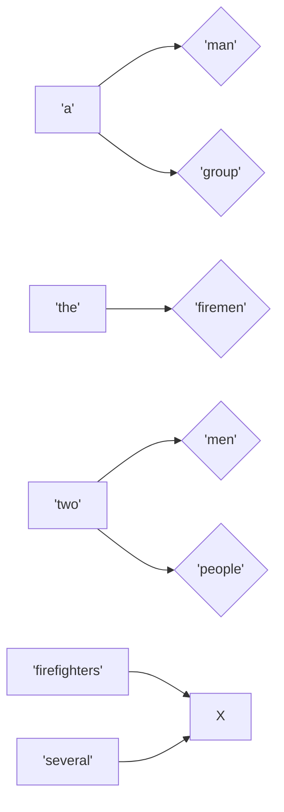
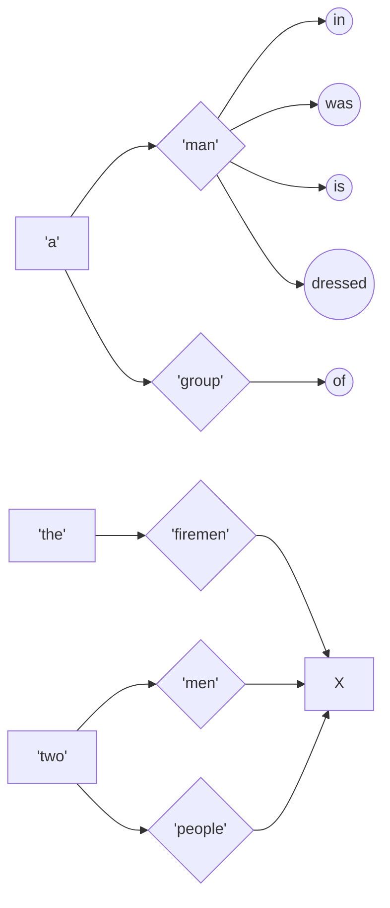
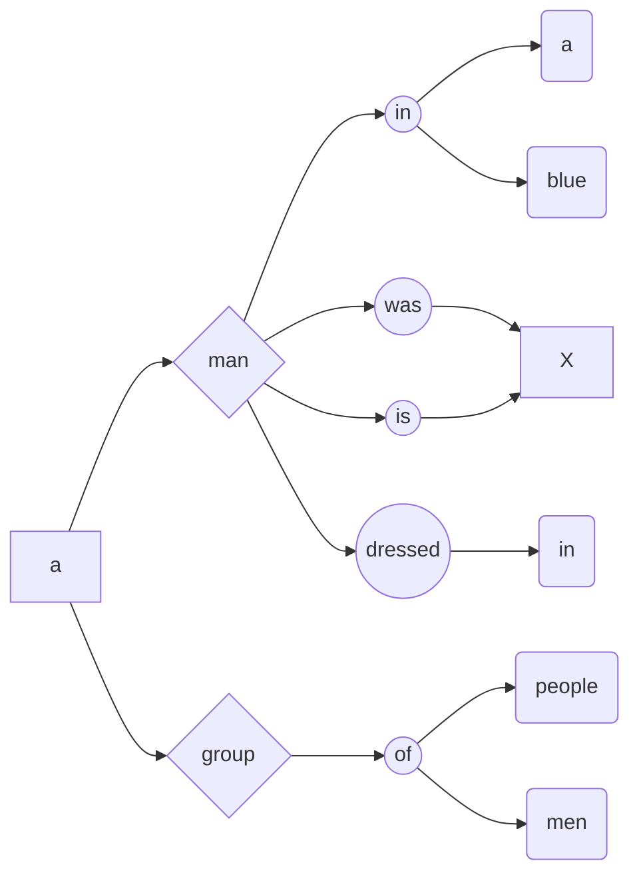
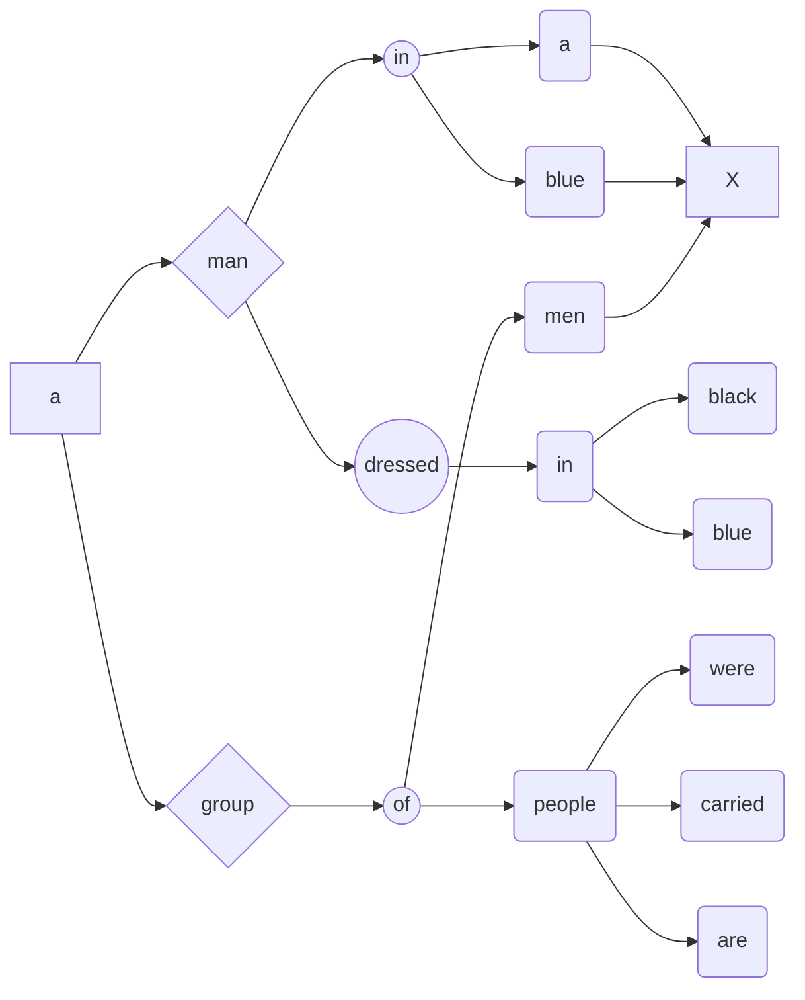

# NLP:Teacher Forcing和Beam Search（束搜索）

> 最近开始写关于NLP的模型，模型在**训练阶段**使用Teather Forcing(导师驱动)的方法训练模型。模型在**推断（inference）阶段**需要一种搜索算法来找出比较好的输出语句。NLP中最常用的就是Beam Search算法了。这里记录一下两者。

### 一、问题陈述

做机器翻译或其他文本生成任务时，常使用seq2seq、Encoder -> Decoder这样的网络架构。其中通常会训练RNN、LSTM等解码网络，来将前面使用各种手段编码的特征转换为文字序列。其中在训练和验证阶段，解码网络使用**导师驱动(teacher forcing)**的方式来训练网络。而在推断阶段，因为没有"标准答案（label）"，解码网络推断文字序列的方式和训练阶段有细微的差别，需要使用到Beam Search算法。

1. #### **训练阶段：导师驱动**

比如在机器翻译任务中，训练阶段我们要翻译的句子是有“标准答案（label）”的。因此训练时每个时间步t，不管任何RNN还是门控RNN（LSTM..）。输入为**上一时刻的输出$y_{t-1}$和t时刻对应的词$x_t$，**输出为t时刻在已知$x_1...x_t$等词的条件下，生成的词$y_1...y_t$的条件概率分布。即$p(y_1,y_2.,.y_t|x_1,x_2...,x_t)$

其中：
$$
p(Y|X)=p(y_1,y_2.,.y_t|x_1,x_2...,x_t)=\\
p(y_t|X,y_1,y2,...y_{t-1})p(y_{t-1}|X,y_1,y2,...y_{t-2})...p(y_2|X,y_1)p(y_1|X)
$$

两边取对数：
$$
log\ p(Y|X)=log\ p(y_1,y_2.,.y_t|x_1,x_2...,x_t)=\\
log\ p(y_t|X,y_1,y2,...y_{t-1})+\\
log\ p(y_{t-1}|X,y_1,y2,...y_{t-2})+...+\\
log\ p(y_2|X,y_1)+log\ p(y_1|X)
$$

理论上当**最大化上面这个对数条件似然**输出的文字序列就是训练阶段希望得到的序列。一般机器学习和深度学习领域**极大化似然估计就等于极小化交叉熵损失**。基于这一点，实际编程中设置损失函数为CrossEntropyLoss，输入训练样本的标签$Y$的前t个词和Decoder在t时刻解码的输出$y_t（经过softmax处理后）$，即可正常训练模型。

**teacher foring 和 free-running mode**：刚开始学习RNN时，给出的训练和推断方式都是下图右边表示的**free-running mode**，也就是将t-1时刻的隐藏态$h_{t-1}$作为t时刻的输入。在该模式下训练时是不需要"标准答案"的。而teacher forcing模式下，训练时会参考"标准答案"，提高了训练效果。但是在推断阶段只能使用free-running mode，导致没有“标准答案”供推断阶段使用，如果测试集与训练集中的样本有较大区别。模型推断还是会按照训练集的"标准答案"去推断测试集的样本，模型的表现可能不尽人意。为了解决这一问题，有一个好方法：Beam Search。[这篇博客分析的很棒](https://www.cnblogs.com/dangui/p/14690919.html)

2. #### **推断阶段：Beam Search**

一般来说推断阶段是没有"标准答案"的，无法使用导师驱动。就像学生学习时本来有导师在旁边指导，学习得到的答案就很接近正确答案。但是没有导师时，就需要学生根据之前学习到的知识自己答题，当然得到的答案是不唯一的。为此在推断阶段，很容易想到两种搜索"答案"的方法：**贪心和穷举**。

**贪心和穷举搜索**：设t时刻推断出来的词向量的分布情况为$p(y_t|X,y_1,y2,...y_{t-1})$，一般这个数值的形状为（1，字典大小），比如字典中就3个词i，love，coding。对应的概率分布为（0.5,0.3, 0.2）。则贪心搜索会选择概率最大的词作为t时刻推断出来的$y_t$。不断推进时间步，最终得到的文字序列中的每个位置上的词都是该时刻概率最大的词。穷举顾名思义，每个时间步的所有概率的词都要考虑，这其实是一个**广度优先搜索（BFS）**的过程。**穷举时间复杂度太高**首先淘汰。而**贪心搜索**可以认为是每一个词都取最优，而对于最后推断出来的句子，这种**局部最优不一定是全局最优**（暂时没有证明，但是我的实验结果确实是符合这一现象的）。

**bean search**		[快速理解](https://zhuanlan.zhihu.com/p/82829880)

我的理解**束搜索是使用启发式信息对BFS构建的搜索树进行剪枝**。而这个启发式信息在机器翻译、文本生成等任务中就是**t时刻每个词的概率**，以及t时刻生成句子的**得分**。还有一种理解是：同时使用多个一样的模型进行推断，比如使用5个模型同时进行5个句子的推断，同时还要保证5个句子不一样！反映到由BFS构建的整个搜索空间中，就是一共有5条线路在同步进行推断，这5条线路是唯一的。

如下图所示，整个搜索树中有两个路线。而每一层（时刻t）选择搜索结点时，就需要使用到A和B这两个词在该时刻的概率大小。

### 二、流程实例

实例demo来自于[这个项目：video caption]()，其中beam width为5

step1：刚开始所有句子开头为\<start>这个特殊字符
incomplete：
['\<start>']
['\<start>']
['\<start>']
['\<start>']
['\<start>']
complete：

step2：第一个时刻，根据\<start>推断出来了5个字符
incomplete：
['\<start>', 'a']
['\<start>', 'the']
['\<start>', 'two']
['\<start>', 'firefighters']
['\<start>', 'several']
complete：

step3：第二个时刻，又新推断出来了5个字符。但是注意到前一时刻的5个字符缺少了'firefighters'和‘several’。这就是beam search容易令人迷糊的一点：虽然是使用beam width，即5个模型同步推断5个句子，但是这5个句子**不是独立的**！设该时刻五个词向量分布为$p$,形状为:(5，字典大小)。取前5个概率分布最大的词作为该时刻推断的词，并不是取p.topk(dim=1)，而是取p.view(-1).topk()。即是**从取5*字典大小的概率分布中取前5个概率最大的词**！

incomplete：
['\<start>', 'a', 'man']
['\<start>', 'a', 'group']
['\<start>', 'the', 'firemen']
['\<start>', 'two', 'men']
['\<start>', 'two', 'people']
complete：

step4:同上，这个时刻推断出来的概率最大的5个词全部来自于这个两个前提条件['\<start>', 'a', 'man']，['\<strat>', 'a', 'group']下的概率分布

incomplete
['\<start>', 'a', 'group', 'of']
['\<start>', 'a', 'man', 'in']
['\<start>', 'a', 'man', 'was']
['\<start>', 'a', 'man', 'is']
['\<start>', 'a', 'man', 'dressed']
complete

step5

incomplete
['\<start>', 'a', 'group', 'of', 'people']
['\<start>', 'a', 'man', 'dressed', 'in']
['\<start>', 'a', 'man', 'in', 'a']
['\<start>', 'a', 'group', 'of', 'men']
['\<start>', 'a', 'man', 'in', 'blue']
complete

step6

incomplete
['\<start>', 'a', 'group', 'of', 'people', 'were']
['\<start>', 'a', 'group', 'of', 'people', 'carried']
['\<start>', 'a', 'group', 'of', 'people', 'are']
['\<start>', 'a', 'man', 'dressed', 'in', 'black']
['\<start>', 'a', 'man', 'dressed', 'in', 'blue']
complete

step7
incomplete
['\<start>', 'a', 'group', 'of', 'people', 'were', 'sitting']
['\<start>', 'a', 'group', 'of', 'people', 'were', 'walking']
['\<start>', 'a', 'group', 'of', 'people', 'carried', 'a']
['\<start>', 'a', 'group', 'of', 'people', 'were', 'carrying']
['\<start>', 'a', 'man', 'dressed', 'in', 'black', 'was']
complete

step8
incomplete
['\<start>', 'a', 'group', 'of', 'people', 'were', 'sitting', 'in']
['\<start>', 'a', 'group', 'of', 'people', 'were', 'carrying', 'a']
['\<start>', 'a', 'group', 'of', 'people', 'were', 'walking', 'in']
['\<start>', 'a', 'group', 'of', 'people', 'were', 'sitting', 'on']
['\<start>', 'a', 'group', 'of', 'people', 'carried', 'a', 'man']
complete

step9
incomplete
['\<start>', 'a', 'group', 'of', 'people', 'were', 'sitting', 'in', 'the']
['\<start>', 'a', 'group', 'of', 'people', 'were', 'walking', 'in', 'the']
['\<start>', 'a', 'group', 'of', 'people', 'were', 'sitting', 'on', 'the']
['\<start>', 'a', 'group', 'of', 'people', 'were', 'sitting', 'in', 'a']
['\<start>', 'a', 'group', 'of', 'people', 'carried', 'a', 'man', 'in']
complete

step10
incomplete
['\<start>', 'a', 'group', 'of', 'people', 'carried', 'a', 'man', 'in', 'a']
['\<start>', 'a', 'group', 'of', 'people', 'were', 'sitting', 'in', 'the', 'water']
['\<start>', 'a', 'group', 'of', 'people', 'were', 'sitting', 'on', 'the', 'ground']
['\<start>', 'a', 'group', 'of', 'people', 'were', 'walking', 'in', 'the', 'water']
['\<start>', 'a', 'group', 'of', 'people', 'were', 'walking', 'in', 'the', 'street']
complete

step11：经过了11轮迭代，有4个句子推断出来了\<end>字符，代表着这4个句子完成了推断，不用参与到下一轮的迭代。但是['\<start>', 'a', 'group', 'of', 'people', 'were', 'sitting', 'on', 'the', 'ground', 'in']还需要继续迭代至推断出来\<end>字符
incomplete
['\<start>', 'a', 'group', 'of', 'people', 'were', 'sitting', 'on', 'the', 'ground', 'in']
complete
['\<start>', 'a', 'group', 'of', 'people', 'were', 'sitting', 'in', 'the', 'water', '\<end>']
['\<start>', 'a', 'group', 'of', 'people', 'were', 'walking', 'in', 'the', 'water', '\<end>']
['\<start>', 'a', 'group', 'of', 'people', 'were', 'sitting', 'on', 'the', 'ground', '\<end>']
['\<start>', 'a', 'group', 'of', 'people', 'were', 'walking', 'in', 'the', 'street', '\<end>']

step12
incomplete
['\<start>', 'a', 'group', 'of', 'people', 'were', 'sitting', 'on', 'the', 'ground', 'in', 'the']
complete
['\<start>', 'a', 'group', 'of', 'people', 'were', 'sitting', 'in', 'the', 'water', '\<end>']
['\<start>', 'a', 'group', 'of', 'people', 'were', 'walking', 'in', 'the', 'water', '\<end>']
['\<start>', 'a', 'group', 'of', 'people', 'were', 'sitting', 'on', 'the', 'ground', '\<end>']
['\<start>', 'a', 'group', 'of', 'people', 'were', 'walking', 'in', 'the', 'street', '\<end>']

step13
incomplete
['\<start>', 'a', 'group', 'of', 'people', 'were', 'sitting', 'on', 'the', 'ground', 'in', 'the', 'room']
complete
['\<start>', 'a', 'group', 'of', 'people', 'were', 'sitting', 'in', 'the', 'water', '\<end>']
['\<start>', 'a', 'group', 'of', 'people', 'were', 'walking', 'in', 'the', 'water', '\<end>']
['\<start>', 'a', 'group', 'of', 'people', 'were', 'sitting', 'on', 'the', 'ground', '\<end>']
['\<start>', 'a', 'group', 'of', 'people', 'were', 'walking', 'in', 'the', 'street', '\<end>']

step14：全部句子推断完成！
incomplete
complete
['\<start>', 'a', 'group', 'of', 'people', 'were', 'sitting', 'on', 'the', 'ground', 'in', 'the', 'room','\<end>']
['\<start>', 'a', 'group', 'of', 'people', 'were', 'sitting', 'in', 'the', 'water', '\<end>']
['\<start>', 'a', 'group', 'of', 'people', 'were', 'walking', 'in', 'the', 'water', '\<end>']
['\<start>', 'a', 'group', 'of', 'people', 'were', 'sitting', 'on', 'the', 'ground', '\<end>']
['\<start>', 'a', 'group', 'of', 'people', 'were', 'walking', 'in', 'the', 'street', '\<end>']

最后beam search算法成功搜索到了5个完整的句子。这里选择概率最大的句子作为最终的输出。即$max[p(y_1,y_2,y_3...y_n|x)]=max[{p(y_1|x)}*p(y_2|y_1,x)*p(y_3|y_1,y_2,x)*...*p(y_n|y_1,y_2,...,x)]$

而本例中最后输出的句子是：['\<start>', 'a', 'group', 'of', 'people', 'were', 'walking', 'in', 'the', 'street', '\<end>']，可见最长的句子不代表最终概率最大。

并且很容易想到，如果将beam_width设定得更大，就代表搜索路线会更多。那么最终也应该搜索到更好的答案。我的实践中，设置特别大的beam_width确实能够榨取模型的最佳性能。但是推断时间也会特别长。据吴恩达课程中所说：工业部署模型时beam_width一般设置在5-20左右。

